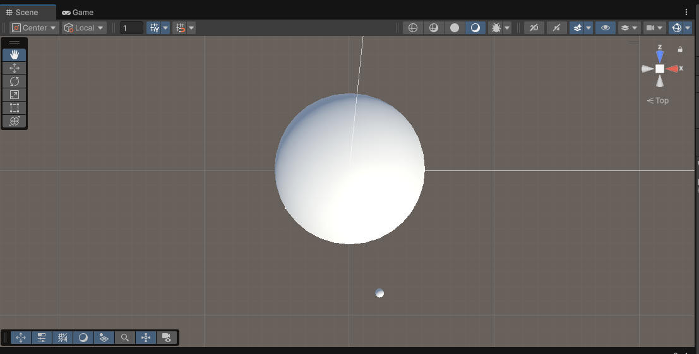

# Mini Digital Twin: 3D Satellite Visualization



## Project Overview

This Unity project implements a **Mini Digital Twin** of a Low‐Earth‐Orbit (LEO) satellite network.  
It features:

- **Orbiting Satellite**: A sphere that continuously circles an “Earth” sphere.
- **Ground Stations**: Three station markers positioned on the Earth’s surface.
- **Handover Detection**: Real-time calculation of which station is closest to the satellite, with a running handover count.
- **UI Overlay**: On-screen text displaying the current station and total handover events.
- **Multiple Camera Views**: Cycle through default, follow-cam, and top-down views by pressing **C**.

This demo showcases how to combine basic orbital mechanics, distance-based events, and Unity UI to build an intuitive 3D “digital twin” of a non-terrestrial network.

---

## Features

- **Satellite Orbit**  
  − Configurable orbit radius & period via the **Orbit** C# component.
- **Handover Logic**  
  − Detects and logs when the satellite switches between ground stations.
- **UI Text**  
  − Displays `Station: <Name>` and `Handovers: <Count>` in the corner of the screen.
- **Camera Switching**  
  − Press **C** at runtime to cycle through three camera angles:
    1. **Default**
    2. **Follow** (trails behind the satellite)
    3. **Top-Down** (overhead view)

---

## Requirements

- **Unity Hub** & **Unity 2023.x LTS** (or later)
- **.NET Framework 4.x** (included with Unity)
---

## Project Structure
````
digital-twin-demo/
├── Assets/
│ ├── Scenes/
│ ├── Scripts/
├── ProjectSettings/
├── screenshots/
├── .gitignore
└── README.md
